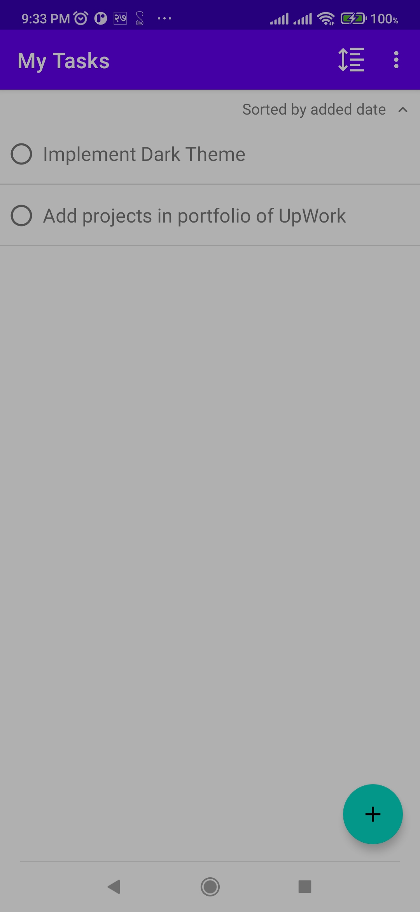
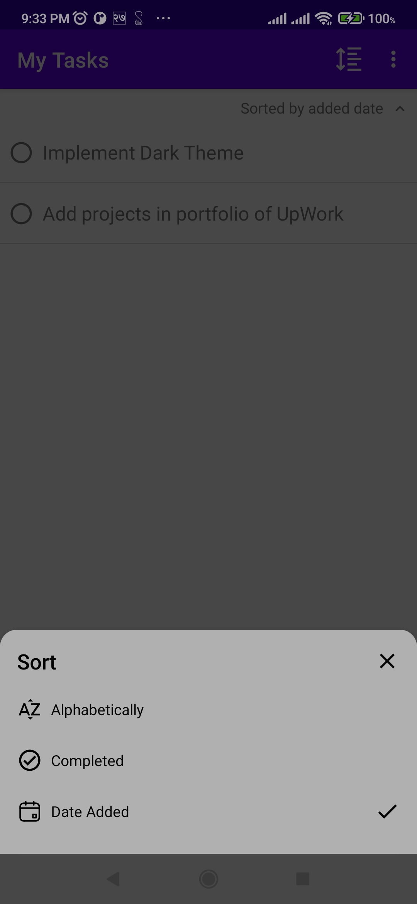
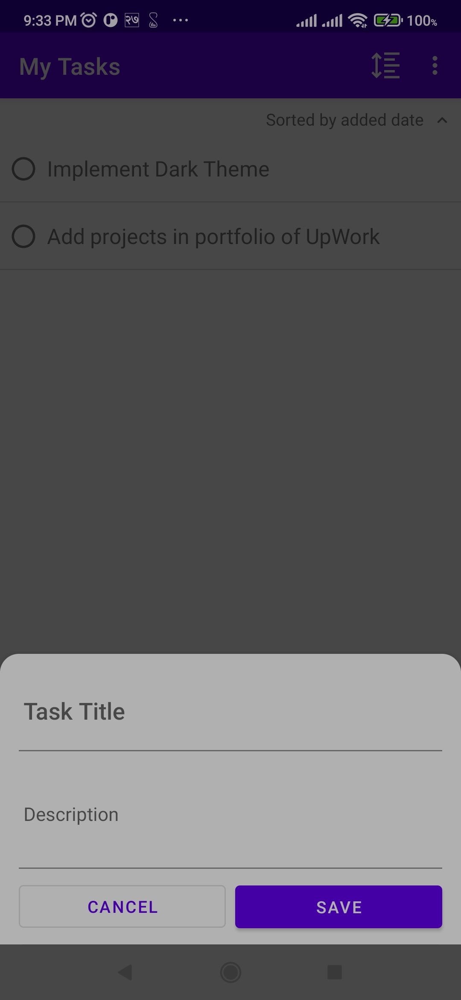
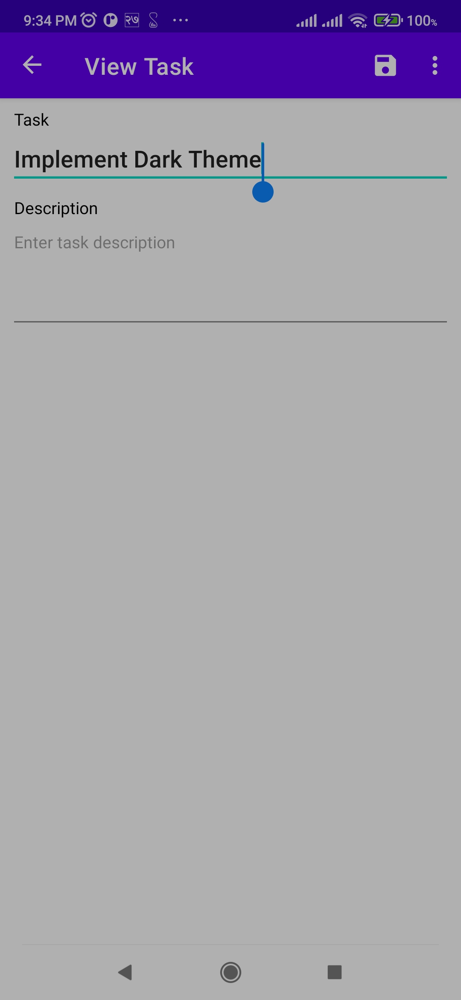

# To-Do #

To run this app, clone the project and after successful build in the Android Studio we can sipmly run the project onto a physical device or an emulator

## Screenshots ##
### Splash Screen | My Tasks ###

### Sort By Bottom Sheet | Add Task Bottom Sheet ###

### View Task (Details) ###

